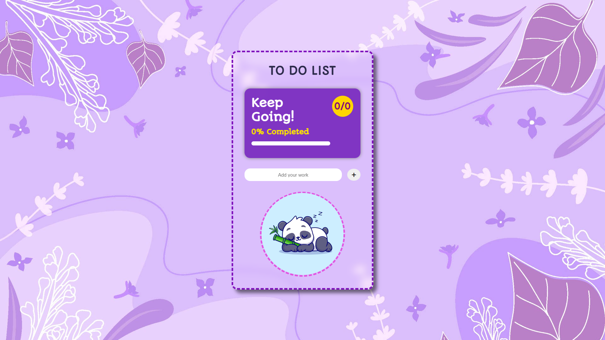
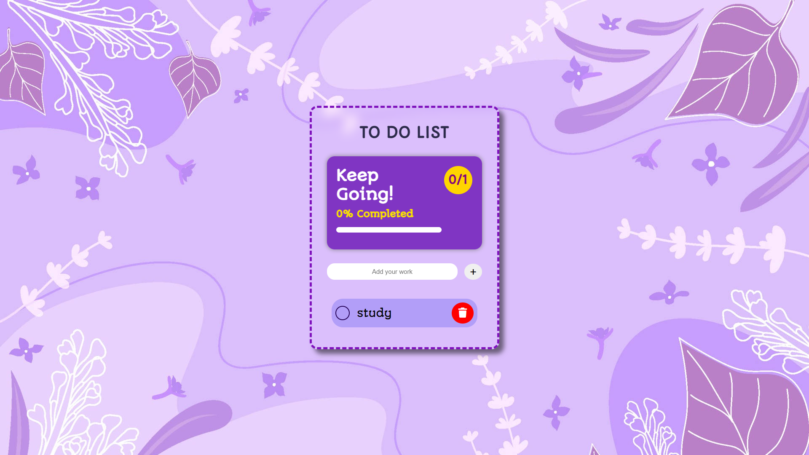

# 📝 TaskFlow - Modern To-Do List

> **A modern, responsive, and feature-rich To-Do List application built with HTML, CSS, and Vanilla JavaScript.**
>
> Designed to strengthen core JavaScript concepts such as DOM manipulation, state management, Local Storage, and dynamic UI updates without using any frontend frameworks.

---

## 🌐 Live Demo

🔗 **Live Website:** **

---

## 📸 Preview

>

### Home Screen





### Tasks Added





### All Tasks Completed 🎉


---

# ✨ Features

✅ Add new tasks

✅ Delete tasks

✅ Mark tasks as completed

✅ Progress bar with live completion percentage

✅ Dynamic task counter

✅ Local Storage support (tasks remain after refresh)

✅ Beautiful empty-state illustration

✅ Responsive design for desktop and mobile

✅ Celebration confetti animation after completing all tasks

✅ Clean and modern UI

---

# 🚀 Tech Stack

| Technology       | Purpose                     |
| ---------------- | --------------------------- |
| HTML5            | Structure                   |
| CSS3             | Styling & Responsive Design |
| JavaScript (ES6) | Application Logic           |
| Local Storage    | Persistent Data             |
| Canvas Confetti  | Celebration Animation       |

---

# 📂 Folder Structure

```text
TaskFlow/
│
├── README.md
├── preview/
│   ├── hero.gif        ⭐
│   ├── home.png
│   ├── tasks.png
│   └── completed.png
│
├── images/
│   ├── light-background.jpg
│   └── empty.png
│   
│
├── index.html
├── style.css
└── script.js
```

---

# 🎯 How It Works

1. Enter a task.
2. Click **Add** or press **Enter**.
3. The task is instantly displayed.
4. Every change is automatically saved in Local Storage.
5. Mark tasks as completed to update the progress bar.
6. Finish every task to trigger the celebration animation.

---

# 🧠 What I Learned

This project helped me strengthen my understanding of:

* DOM Manipulation
* Event Handling
* JavaScript Functions
* Array Methods
* Objects
* Local Storage
* Dynamic Element Creation
* State Management
* Responsive UI Design
* Code Organization
* User Experience Design

Instead of placing all logic inside one large function, I organized the application into reusable functions to improve readability and maintainability.

---

# ⚡ Challenges I Faced

During development, I encountered several challenges, including:

* Managing application state after page refresh.
* Keeping the progress bar synchronized with completed tasks.
* Dynamically creating and removing task elements.
* Persisting task completion status using Local Storage.
* Organizing JavaScript into modular, reusable functions.

Solving these problems significantly improved my understanding of Vanilla JavaScript.

---

# 🔮 Future Improvements

* ✏️ Edit existing tasks
* 🔍 Search functionality
* 📅 Due dates
* ⭐ Task priorities
* 🗂️ Categories
* 🌙 Dark Mode
* 📌 Drag & Drop task sorting
* ☁️ Backend integration for multiple users
* 🔐 User Authentication

---

# 📈 Project Highlights

* Responsive across devices
* Beginner-friendly code structure
* Clean UI with smooth interactions
* Persistent data using Local Storage
* Lightweight and framework-free
* Built completely from scratch using Vanilla JavaScript

---

# 👨‍💻 About the Developer

Hi! I'm  I'm **Sumana Howlader**, a **B.Tech Computer Science student** passionate about frontend development and continuously improving my problem-solving skills by building real-world projects.

This project is part of my learning journey toward becoming a professional Full-Stack Developer.

I'm currently exploring:

* JavaScript
* React
* Node.js
* Data Structures & Algorithms
* Open Source

📧 Email: sumana9106@gmail.com

💼 LinkedIn: Sumana Howlader

🔗 LinkedIn: https://www.linkedin.com/in/sumana-howlader-804863377

---

# 🤝 Feedback

Suggestions, improvements, and constructive feedback are always welcome.

If you have ideas to improve this project, feel free to open an issue or submit a pull request.

---

# ⭐ Support

If you enjoyed this project or found it helpful, consider giving it a **⭐ Star**.

It motivates me to continue building and sharing more projects.

---

## Thank you for visiting! ❤️
